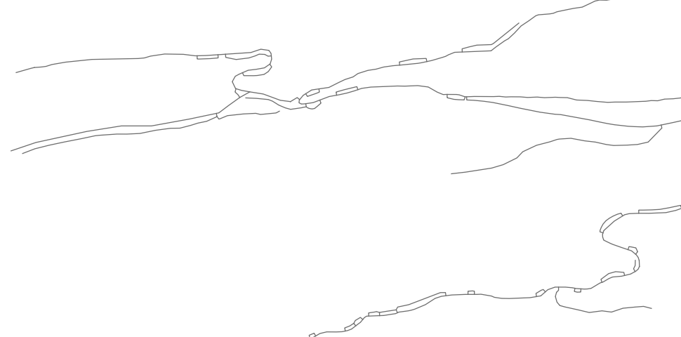

# BC Cumulative Effects Framework
## Integrated Roads File Geodatabase Feature Class

## Tags
British Columbia, Cumulative Effects Framework, Integrated Roads, CE, CEF

## Summary 

This data set was created specifically for cumulative effects (CE) analysis in British Columbia, Canada. 
It is intended for strategic level analysis, and should not be considered positionally accurate, or be used for navigation. 
This data was created by the scripts held in the [CE_integratedroads](https://github.com/bcgov/CE_integratedroads) GitHub repository.

## Disclaimer 

This CEF data set was generated from publicly accessible data which have varying levels of quality, accuracy, and completeness. 
Users are encouraged to view the [BC Data Catalogue](https://catalogue.data.gov.bc.ca) metadata records of the data inputs for information on accuracy, completeness, and data licencing. 
This CEF data set has an accompanying Excel spreadsheet listing data input sources, and their respective BC Data Catalogue record hyperlinks. 
It is also recommended to read the [BC Data Catalogue disclaimer](https://www2.gov.bc.ca/gov/content/home/disclaimer) and explore the different terms of use for the Province of British Columbia’s [various data licences](https://bcgov.github.io/data-publication/pages/dps_licences.html).

## Data Accuracy 

**This data should not be considered positionally accurate or used in navigation. This data was designed for strategic level cumulative effects analysis and is only meant for coarse-scale GIS analysis, summarized by large assessment units such as BC’s landscape units. This data is not sufficiently accurate for site-specific analysis for proposed developments. This data is merely a starting point for conversations about human activity and has many identified gaps when compared to satellite imagery.**

## Description 

This data does not contain any additional linework or attributes that do not already exist in other road data sets. This data contains linework and attributes conflated from publicly accessible sources from the BC Geographic Warehouse (BCGW), which represent both built roads and road tenures. It may contain duplicates of some roads that are not within the integration distance (7 metres either side of the centreline), roads that were never built, and roads that are now overgrown or impassible for some other reason. It may also be missing roads. Therefore, this data set does not represent a complete conflation of all input road data sources, and due to the duplication in BC’s Road data sets, the output often over-represents roads on the ground.

**In summary, there is no new information in this data, it is simply a quick “mash up” of existing, publicly accessible road datasets** (data sources are listed below).

## Method

An integrated roads product created by consolidating various BCGW road sources in a hierarchical order (listed below).  

Where a lower priority road feature is within 7 metres of a higher priority road, it is snapped to the location of the higher priority road.  

Once all data are snapped/integrated, roads from each source are added to the output layer if they are not already in the output from the previous (higher priority) sources.  

NOTE - Geometry: Road linework may have been shifted or snapped within 7m where overlaps occurred, or where linework was close-together. Where linework was close, but not within 7m, additional line fragments may be present.  

NOTE - Attributes: Not every record has a value for every field. Select attributes have been kept for each source, but only populated for that source’s associated attribute field. Attributes populated with values for all data sources are:  

| column name            | description               |
|------------------------|---------------------------|
|`INTEGRATED_ROADS_ID`   | unique identifying number |
|`BCGW_SOURCE`           | the source road data set name |
|`BCGW_EXTRACTION_DATE`  | the date the source road data was accessed/extracted. YYYY-MM-DD |
|`CEF_ROAD_PRIORITY_RANK`| numerical values from 1-7 identifying the priority rank of the input dataset |
|`CEF_ROAD_ATTR_SRC_LIST`| numerical values from 1-7 identifying attribute sources by priority rank of input datasets, separated by semi-colons |

## Road Data Sources and Conflation Rank 

Road data sources listed in hierarchical order (i.e., DRA takes priority, if lower ranked roads are within 7 metres on either side of the centreline, and so on down the list).

| rank | source        | notes      |
|------|---------------|------------|
| 1 | `WHSE_BASEMAPPING.DRA_DGTL_ROAD_ATLAS_MPAR_SP` | downloaded from [ftp](ftp://ftp.geobc.gov.bc.ca/sections/outgoing/bmgs/DRA_Public/dgtl_road_atlas.gdb.zip)|
| 2 | `WHSE_FOREST_TENURE.FTEN_ROAD_SECTION_LINES_SVW` | active |
| 3 | `WHSE_FOREST_TENURE.FTEN_ROAD_SECTION_LINES_SVW` | retired (retired means no longer under permit, but road may still exist) |
| 4 | `WHSE_FOREST_VEGETATION.RSLT_FOREST_COVER_INV_SVW` | polygons converted to centerlines |
| 5 | `WHSE_MINERAL_TENURE.OG_PETRLM_DEV_RDS_PRE06_PUB_SP` | |
| 6 | `WHSE_MINERAL_TENURE.OG_ROAD_SEGMENT_PERMIT_SP` | |
| 7 | `WHSE_MINERAL_TENURE.OG_ROAD_AREA_PERMIT_SP` | polygons converted to centerlines |

## Use limitations 

This dataset was created specifically for cumulative effects analysis. It is intended for strategic level analysis and should not be considered as positionally accurate or used for navigation. 

## Contacts

Melissa Woods <melissa.woods@gov.bc.ca>  
Lianne Scott <lianne.scott@gov.bc.ca>

## Extent

West 	-137.897539	   
East 	-110.430046  
North 	60.438947	   
South 	47.687185 

## Geometry Gaps and Limitations

Several specific issues will lead to the over- or under-representation of roads:

- Roads may have been decommissioned, overgrown or become otherwise impassible.
- Duplicate same-source roads are not accounted for.
- Roads may be present in road tenure data sources that have not yet been built.
- The same road present in different source layers will only be de-duplicated when features are less than 7m apart.
- The road data sources used are not 100% comprehensive, and there may be roads present in the landscape that are not included in the analysis and output product.

## Attribute Gaps and Limitations
- DRA Capture Date is date of the information source that the road feature was captured from (example: satellite imagery date flown) but the road could have been built years before.
- FTEN Award Date is the tenure awarded data, not when the road was built. A road may have been built in following years or may never have been built if the tenure lapsed.
- FTEN_LIFE_CYCLE_STATUS_CODE = ‘Retired’ does not mean the road is necessarily decommissioned. It means the road is no longer under tenure and may not have been built.
- DRA_Road_Surface = ‘Decommissioned’ is not necessarily verified and the ‘Decommissioned’ value does not capture all decommissioned roads as time passes.
- RESULTS/OGC Area Permits come from polygon centrelines. No attributes are carried over.
- Road Condition information is not consistently available across BC’s road data sets.
- Road Usage information cannot be inferred from the road type.

## Geometry Duplications

These diagrams illustrate a problematic sample area, showing 3 similar road inputs 

Input road sources:

Resulting output:

